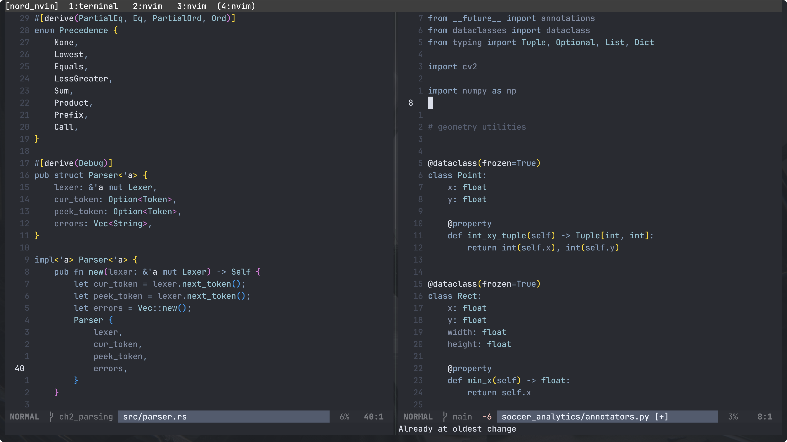

# nord.nvim

A Neovim colorscheme based on [Cursor's](https://cursor.com/home?from=agents) take the [Nord](https://www.nordtheme.com/docs/colors-and-palettes)  color palette.



## Setup

### lazy.nvim
```lua
{
	"jwllzp/nord.nvim",
	lazy = false,
  priority = 1000,
	config = function()
		require("nord").setup()
	end,
}
```

